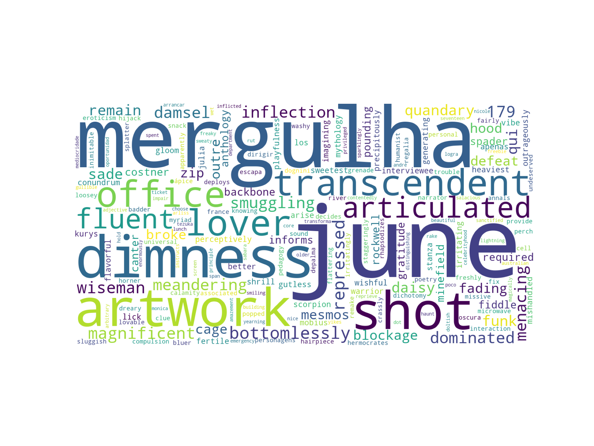

# Sentiment Analysis

Model trained on Netflix reviews.

[https://github.com/kasperski95/wieik-si-project-v4
]([https://link](https://github.com/kasperski95/wieik-si-project-v4))

---

## Usage
```sh
(env) PS wieik-si-project-v4> python test.py --review "I stopped watching after 15 minutes."
RAW: I stopped watching after 15 minutes.
TOKENS: ['I', 'stopped', 'watching', 'after', '15', 'minutes']
TOKENS_REDUCED: ['I', 'stopped', 'watching', '15', 'minutes']
TOKENS_REDUCED_LEMMATIZED: ['I', 'stopped', 'watching', '15', 'minute']
TOKENS_REDUCED_LEMMATIZED_LOWERCASED: ['i', 'stopped', 'watching', '15', 'minute']
Review is positive: 6.19%
Review is negative: 93.81%
```

## Training
```sh
python train.py --word2vec-limit 1000000
```

## Wordcloud
